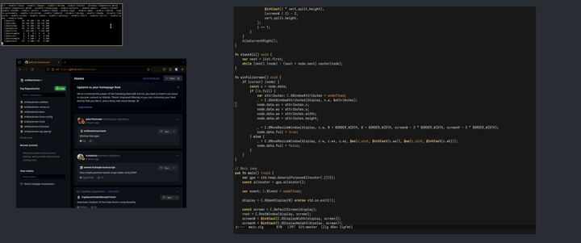

# EWM

My Window Manager designed specifically for my workflow on an ultrawide monitor.
Beware that some things are currently hard-coded for my monitor size.

## Why
Tiling only/by default is terrilbe on ultrawide monitors but floating
only window managers are annoying for other reasons.  I don't want to
have and switch between floating and tiling modes. When only focusing
on one window, keep it centered with a sane width but allow me to tile
windows when needed.

I rather write a WM than trying to bend an existing one to my will
using some made up configuration language.

## Features
- It does what I want
- No configuration

